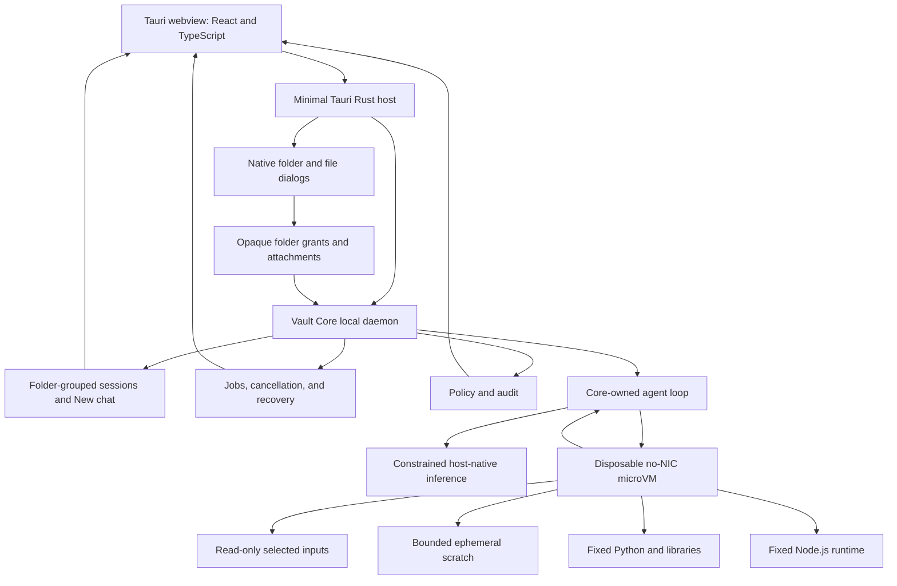

# Desktop Architecture Diagram

Updated: 2026-07-20

## Notes

- The webview has no unrestricted filesystem, shell, process, environment, endpoint, or network capability.
- Vault Core owns grants, sessions, model mediation, limits, cancellation, audit, and result validation.
- The microVM has zero virtual NICs and cannot write to the selected host folder.
- Post-V1 document intelligence may add deterministic fast paths without changing these boundaries.

## Revision History

| Date | Change |
|---|---|
| 2026-07-10 | Created the initial desktop architecture diagram. |
| 2026-07-20 | Reframed the desktop around folder sessions and the generic offline dev-agent microVM. |
