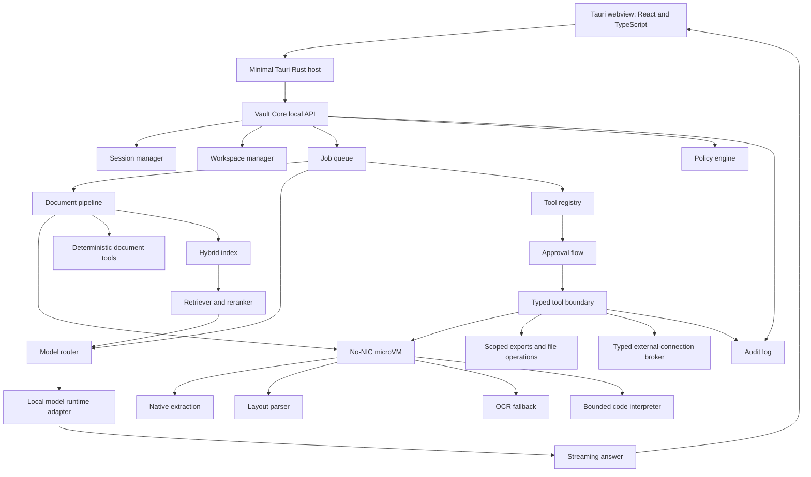

# Desktop Architecture Diagram

Created: 2026-07-10

## Notes

- This is a logical architecture, not an implementation folder map.
- The future orchestration harness should be TypeScript under Node.
- Rust is limited to the thin Tauri host; product behavior remains in Vault Core.
- The microVM has no virtual NIC; authorized external access cannot pass through it.
- Deterministic tools handle supported document operations before the code-interpreter fallback is considered.

## Revision History

| Date | Change |
|---|---|
| 2026-07-10 | Initial desktop architecture diagram created. |
| 2026-07-12 | Added the no-NIC microVM and separate external-connection broker boundaries. |
| 2026-07-13 | Replaced the generic desktop shell with Tauri and added deterministic document tools plus the bounded code interpreter. |
