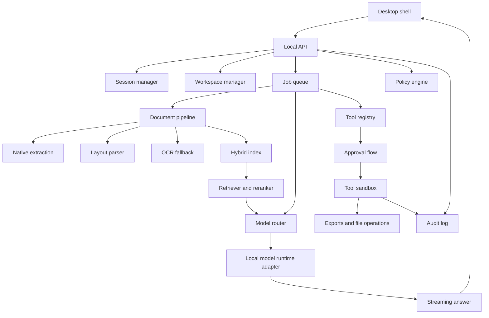

# Desktop Architecture Diagram

Created: 2026-06-29

## Notes

- This is a logical architecture, not an implementation folder map.
- The future orchestration harness should be TypeScript under Node.

## Revision History

| Date | Change |
|---|---|
| 2026-06-29 | Initial desktop architecture diagram created. |
