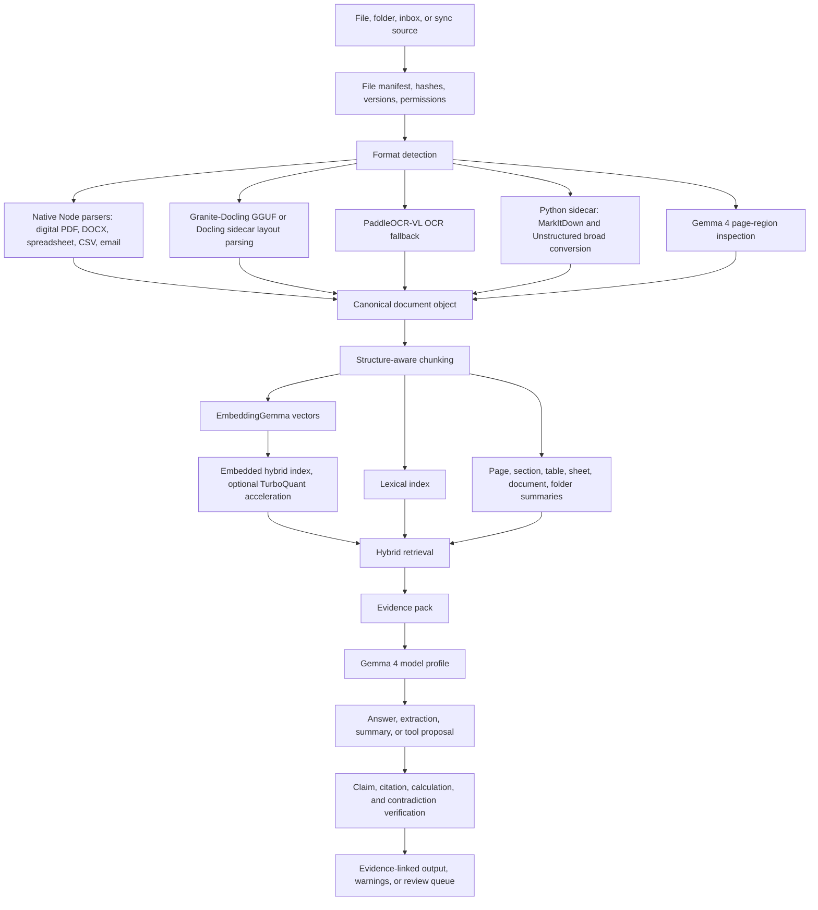

# Document Pipeline Diagram

Created: 2026-06-29

## Notes

- Chunk metadata should preserve document, page, section, table, sheet, cell, row, region, parser, and confidence information.
- Multimodal inspection should be reserved for difficult pages, not used as the default reader.
- Final outputs should pass verification before export.

## Revision History

| Date | Change |
|---|---|
| 2026-06-29 | Initial document pipeline diagram created. |
| 2026-06-29 | Updated pipeline for folder manifests, MarkItDown, Docling, native spreadsheet parsing, EmbeddingGemma, turbovec, summary trees, and verification. |
| 2026-07-11 | Updated parser routing to native-Node-first with Granite-Docling GGUF, PaddleOCR-VL OCR, a single Python sidecar, and an embedded hybrid index with optional TurboQuant acceleration. |
