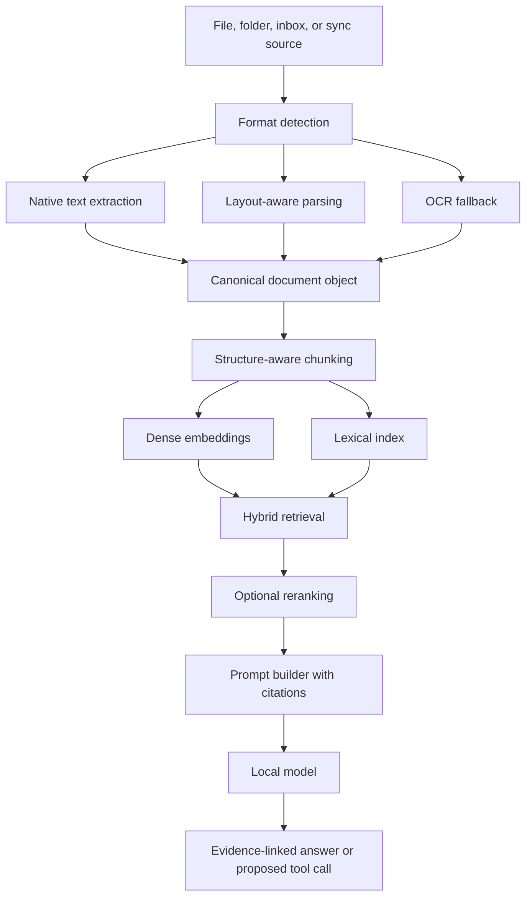

# Document Pipeline Diagram

Created: 2026-06-29

## Notes

- Chunk metadata should preserve page, section, table, region, parser, and confidence information.
- Multimodal inspection should be reserved for difficult pages, not used as the default reader.

## Revision History

| Date | Change |
|---|---|
| 2026-06-29 | Initial document pipeline diagram created. |
