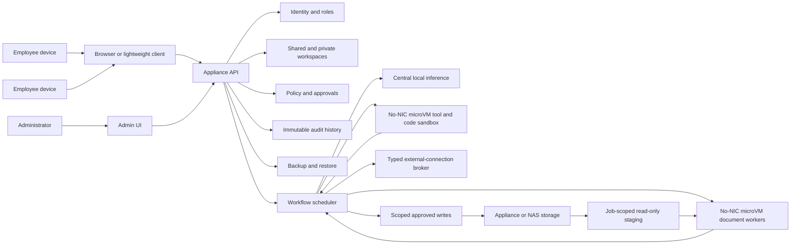

# Office Appliance Diagram

Created: 2026-07-10

## Notes

- Employees keep their existing computers.
- Central local inference and policy controls are the commercial core.
- Storage strategy remains an open decision: documents may remain on NAS or be copied into appliance-managed storage.
- MicroVM workers have no virtual NIC; approved network activity is isolated in the broker.

## Revision History

| Date | Change |
|---|---|
| 2026-07-10 | Initial office appliance diagram created. |
| 2026-07-12 | Added no-NIC microVM workers and a separate external-connection broker. |
| 2026-07-13 | Included bounded generated-code execution in the no-NIC tool sandbox. |
