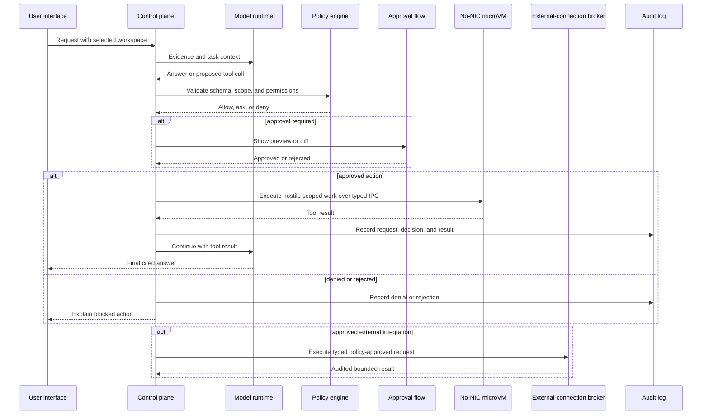

# Security Boundaries Diagram

Created: 2026-07-10

## Notes

- The model never executes tools directly.
- Policy and approval are separate from model reasoning.
- Audit records are created for both successful and blocked actions.
- The microVM has no virtual network device; only the separate broker can perform an approved external request.

## Revision History

| Date | Change |
|---|---|
| 2026-07-10 | Initial security boundaries diagram created. |
| 2026-07-12 | Replaced the generic sandbox with a no-NIC microVM and separate external-connection broker. |
