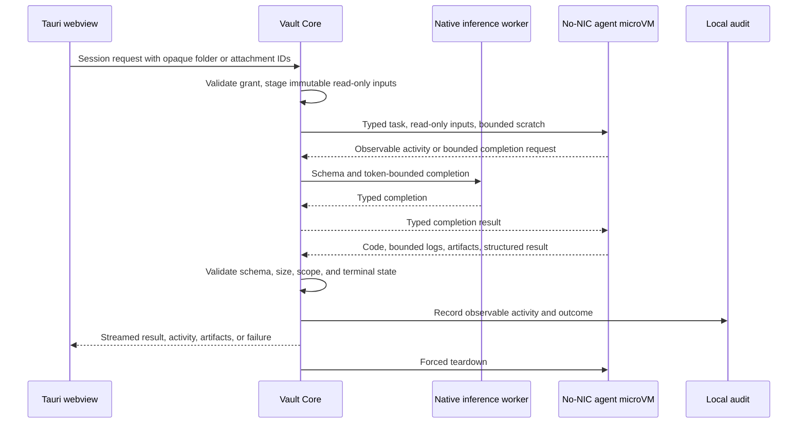

# Security Boundaries Diagram

Updated: 2026-07-20

## Notes

- The model proposes and Vault Core mediates; neither receives direct host execution authority.
- The guest has zero virtual NICs, no credentials, no package installation, no generic host service, and no writable host mount.
- The webview never supplies arbitrary executable names, endpoints, or filesystem paths.
- Generated artifacts remain session-owned proposals and cannot silently mutate the host.

## Revision History

| Date | Change |
|---|---|
| 2026-07-10 | Created the initial security boundaries diagram. |
| 2026-07-12 | Adopted the no-NIC microVM boundary. |
| 2026-07-20 | Made the generic offline agent the V1 execution path. |
