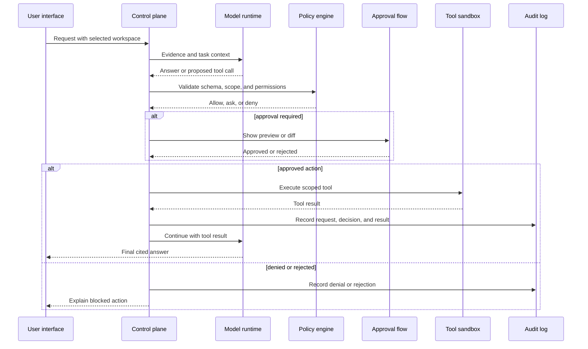

# Security Boundaries Diagram

Created: 2026-07-10

## Notes

- The model never executes tools directly.
- Policy and approval are separate from model reasoning.
- Audit records are created for both successful and blocked actions.

## Revision History

| Date | Change |
|---|---|
| 2026-07-10 | Initial security boundaries diagram created. |
