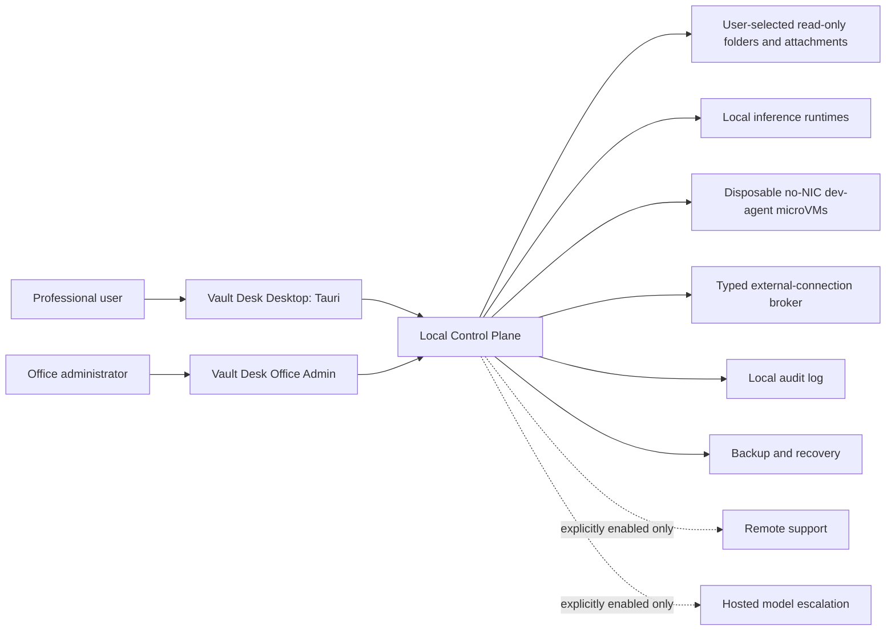

# System Context Diagram

Created: 2026-07-10

## Notes

- Hosted escalation is not a default dependency.
- Remote support is not a default access path.
- Selected inputs remain local and read-only to the guest.
- Agent-authored code has no virtual network device; approved future external connections use the separate broker.

## Revision History

| Date | Change |
|---|---|
| 2026-07-10 | Initial system context diagram created. |
| 2026-07-12 | Added the no-NIC microVM and separate typed external-connection broker. |
| 2026-07-13 | Identified the Tauri desktop shell and bounded code-interpreter microVM role. |
| 2026-07-20 | Made read-only folder sessions and the generic offline dev agent the V1 system context. |
