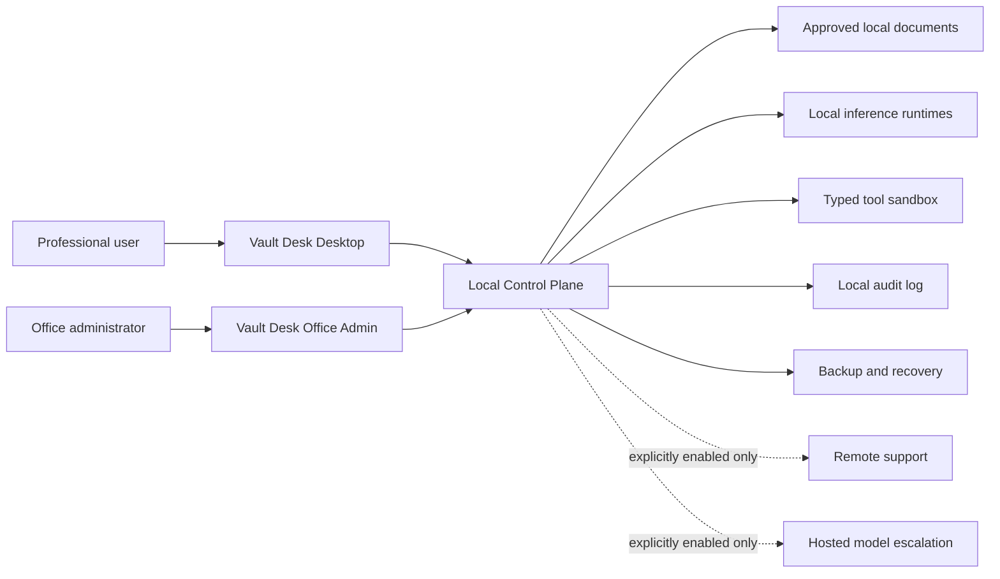

# System Context Diagram

Created: 2026-07-10

## Notes

- Hosted escalation is not a default dependency.
- Remote support is not a default access path.
- Documents remain local unless the user or administrator explicitly authorizes otherwise.

## Revision History

| Date | Change |
|---|---|
| 2026-07-10 | Initial system context diagram created. |
